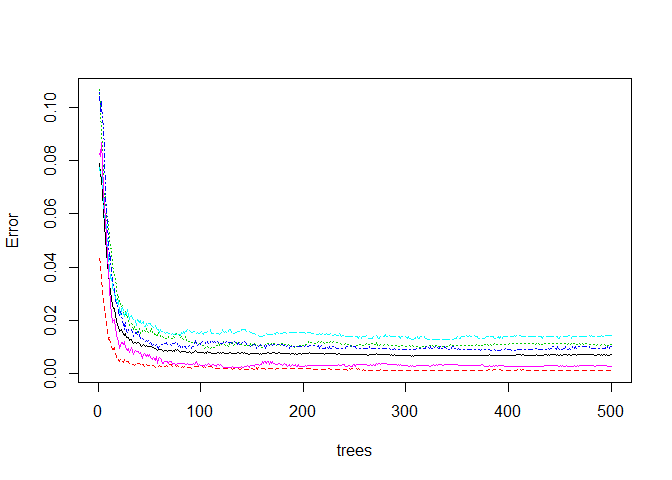

## Summary

Mechanical movement of some parts of the body were recorded by different artifacts to quantified those movements according to different parameters. In this experiment, accelerometers were reading lectures of belt, forearm, arm and dumbell. The purpose of this study is to give an overview of how well the subjects did with the experiment.

## Data analysis

First it is necessay to load the needed packages for the analysis and models that will be used.


```r
library(caret)
library(rattle)
```

One of the basic things that is needed to do is to load the data.


```r
testingFile <- read.csv("data/pml-testing.csv")
trainingFile <- read.csv("data/pml-training.csv")
```

One of the approaches to know the data is to look at the dimensions of the dataset.


```r
dim(testingFile)
```

```
## [1]  20 160
```


```r
dim(trainingFile)
```

```
## [1] 19622   160
```

As it can be seen:

* The testing file has 160 variables and 20 observations.

* The training file has 160 variables and 19622 observations.

In this aspect, it can be a little bit overwhelming to get a peek in the data, since there is a large number of variables in the two datasets.

One of the considerations of large datasets is that there may be some null and/or non beneficial data in the observations. In this case, it is needed to clean the data. For this instance, variables with little variance and variables with a considerable quantity of missing values should be listed out.


```r
noVarianceData <- nearZeroVar(trainingFile)
trainingFile <- trainingFile[, -noVarianceData]

naVariables <- sapply(trainingFile, function(x) mean(is.na(x))) > 0.95
trainingFile <- trainingFile[, naVariables == FALSE]
```

There also are some variables that are not part of the valuable data, so the dataset can be reduced a little bit more in that aspect.


```r
trainingFile <- trainingFile[, -c(1:7)]
dim(trainingFile)
```

```
## [1] 19622    52
```

As shown above, the variables were reduced by 67.5%. With this resulting dataset, it can be said that it is ready to get some models applied.

For this part of the analysis, the train data should be split into two to get the prediction work in the process. This analysis may be taken before considering the 20 principals cases in the testing archive.


```r
inTrain <- createDataPartition(trainingFile$classe, p = 0.7, list = FALSE)
training <- trainingFile[inTrain,]
testing <- trainingFile[-inTrain,]
```

With these data established, some models can be stated to get the most trustful for the testing observations of the original data.

### Linear discriminant analysis


```r
ldaModFit <- train(classe ~ ., data = training, method = "lda")
```


```r
ldaPrediction <- predict(ldaModFit, newdata = testing)
confusionMatrix(ldaPrediction, testing$classe)
```

```
## Confusion Matrix and Statistics
## 
##           Reference
## Prediction    A    B    C    D    E
##          A 1338  147  110   50   51
##          B   43  763  113   55  190
##          C  147  133  640  132  111
##          D  141   51  139  676  124
##          E    5   45   24   51  606
## 
## Overall Statistics
##                                           
##                Accuracy : 0.6836          
##                  95% CI : (0.6715, 0.6955)
##     No Information Rate : 0.2845          
##     P-Value [Acc > NIR] : < 2.2e-16       
##                                           
##                   Kappa : 0.6             
##                                           
##  Mcnemar's Test P-Value : < 2.2e-16       
## 
## Statistics by Class:
## 
##                      Class: A Class: B Class: C Class: D Class: E
## Sensitivity            0.7993   0.6699   0.6238   0.7012   0.5601
## Specificity            0.9150   0.9155   0.8924   0.9075   0.9740
## Pos Pred Value         0.7889   0.6555   0.5503   0.5977   0.8290
## Neg Pred Value         0.9198   0.9204   0.9183   0.9394   0.9076
## Prevalence             0.2845   0.1935   0.1743   0.1638   0.1839
## Detection Rate         0.2274   0.1297   0.1088   0.1149   0.1030
## Detection Prevalence   0.2882   0.1978   0.1976   0.1922   0.1242
## Balanced Accuracy      0.8571   0.7927   0.7581   0.8044   0.7670
```

### Bayesian method


```r
nbModFit <- train(classe ~ ., method = "nb", data = training)
```


```r
nbPrediction <- predict(nbModFit, newdata = testing)
confusionMatrix(nbPrediction, testing$classe)
```

```
## Confusion Matrix and Statistics
## 
##           Reference
## Prediction    A    B    C    D    E
##          A 1460  230  222  188   61
##          B   27  753   67    2   94
##          C   48   83  705  129   43
##          D  122   57   25  597   33
##          E   17   16    7   48  851
## 
## Overall Statistics
##                                          
##                Accuracy : 0.7419         
##                  95% CI : (0.7305, 0.753)
##     No Information Rate : 0.2845         
##     P-Value [Acc > NIR] : < 2.2e-16      
##                                          
##                   Kappa : 0.67           
##                                          
##  Mcnemar's Test P-Value : < 2.2e-16      
## 
## Statistics by Class:
## 
##                      Class: A Class: B Class: C Class: D Class: E
## Sensitivity            0.8722   0.6611   0.6871   0.6193   0.7865
## Specificity            0.8335   0.9600   0.9376   0.9518   0.9817
## Pos Pred Value         0.6756   0.7985   0.6994   0.7158   0.9063
## Neg Pred Value         0.9425   0.9219   0.9342   0.9273   0.9533
## Prevalence             0.2845   0.1935   0.1743   0.1638   0.1839
## Detection Rate         0.2481   0.1280   0.1198   0.1014   0.1446
## Detection Prevalence   0.3672   0.1602   0.1713   0.1417   0.1596
## Balanced Accuracy      0.8528   0.8105   0.8124   0.7856   0.8841
```

### Decision tree


```r
dtModFit <- train(classe ~ ., method = "rpart", data = training)
fancyRpartPlot(dtModFit$finalModel)
```

<!-- -->


```r
dtPrediction <- predict(dtModFit, newdata = testing)
confusionMatrix(dtPrediction, as.factor(testing$classe))
```

```
## Confusion Matrix and Statistics
## 
##           Reference
## Prediction    A    B    C    D    E
##          A 1510  456  471  417  254
##          B   27  387   36  171  224
##          C  104  249  411  141  244
##          D   33   47  108  235   57
##          E    0    0    0    0  303
## 
## Overall Statistics
##                                           
##                Accuracy : 0.4836          
##                  95% CI : (0.4708, 0.4965)
##     No Information Rate : 0.2845          
##     P-Value [Acc > NIR] : < 2.2e-16       
##                                           
##                   Kappa : 0.3251          
##                                           
##  Mcnemar's Test P-Value : < 2.2e-16       
## 
## Statistics by Class:
## 
##                      Class: A Class: B Class: C Class: D Class: E
## Sensitivity            0.9020  0.33977  0.40058  0.24378  0.28004
## Specificity            0.6205  0.90350  0.84812  0.95021  1.00000
## Pos Pred Value         0.4858  0.45799  0.35770  0.48958  1.00000
## Neg Pred Value         0.9409  0.85079  0.87014  0.86512  0.86044
## Prevalence             0.2845  0.19354  0.17434  0.16381  0.18386
## Detection Rate         0.2566  0.06576  0.06984  0.03993  0.05149
## Detection Prevalence   0.5281  0.14359  0.19524  0.08156  0.05149
## Balanced Accuracy      0.7613  0.62163  0.62435  0.59699  0.64002
```

### Random forest


```r
rfControl <- trainControl(method = "cv", number = 3, verboseIter = FALSE)
rfModFit <- train(classe ~ ., method = "rf", trControl = rfControl, data = training)
plot(rfModFit$finalModel, main = "")
```

<!-- -->


```r
rfPrediction <- predict(rfModFit, newdata = testing)
confusionMatrix(rfPrediction, testing$classe)
```

```
## Confusion Matrix and Statistics
## 
##           Reference
## Prediction    A    B    C    D    E
##          A 1673    5    0    0    0
##          B    1 1128    9    0    0
##          C    0    5 1015   18    3
##          D    0    1    2  946    0
##          E    0    0    0    0 1079
## 
## Overall Statistics
##                                         
##                Accuracy : 0.9925        
##                  95% CI : (0.99, 0.9946)
##     No Information Rate : 0.2845        
##     P-Value [Acc > NIR] : < 2.2e-16     
##                                         
##                   Kappa : 0.9905        
##                                         
##  Mcnemar's Test P-Value : NA            
## 
## Statistics by Class:
## 
##                      Class: A Class: B Class: C Class: D Class: E
## Sensitivity            0.9994   0.9903   0.9893   0.9813   0.9972
## Specificity            0.9988   0.9979   0.9946   0.9994   1.0000
## Pos Pred Value         0.9970   0.9912   0.9750   0.9968   1.0000
## Neg Pred Value         0.9998   0.9977   0.9977   0.9964   0.9994
## Prevalence             0.2845   0.1935   0.1743   0.1638   0.1839
## Detection Rate         0.2843   0.1917   0.1725   0.1607   0.1833
## Detection Prevalence   0.2851   0.1934   0.1769   0.1613   0.1833
## Balanced Accuracy      0.9991   0.9941   0.9920   0.9904   0.9986
```

## Final results

As what it can be considered in the models tested for the training dataset, the accuracies from each one would be the exact data needed to stablish the reasonable method to use.

In this case, modeling with random forest would give a close approach to the expected output for the original testing file, since it is the model with an accuracy near to 100%.


```r
predict(rfModFit, newdata = testingFile)
```

```
##  [1] B A B A A E D B A A B C B A E E A B B B
## Levels: A B C D E
```
